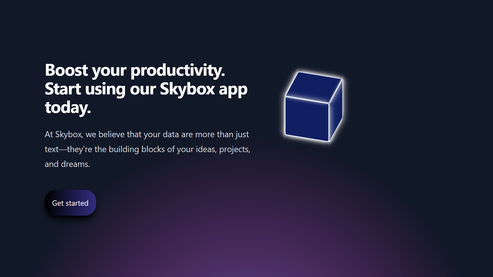
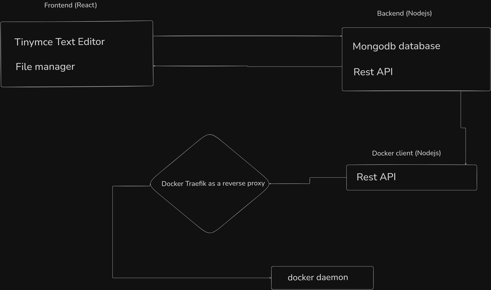

<h1>Skybox</h1>




<br>

<br>

<h1>Skybox's system design</h1>
<br>


<br>

<h2>system design url :</h2>
<a href="https://excalidraw.com/#json=cpXwwLJsj7uytVZ77enNn,iddy2NkJLbeJKbhcYSA6Nw">https://excalidraw.com/#json=cpXwwLJsj7uytVZ77enNn,iddy2NkJLbeJKbhcYSA6Nw</a>
<br>

<h1>Video</h1>
<br>
<video width="640" height="360" controls autoplay  poster="./frontend/src/assets/hoststream.ico">
  <source src="https://dms.licdn.com/playlist/vid/v2/D5605AQFl8eK9FcGwEg/mp4-720p-30fp-crf28/B56Zmv.7KJIYBk-/0/1759594162442?e=2147483647&v=beta&t=pCJ5iqM4KzgR5_xWPaaOP2NGm3t2FuECnHlNT5waLgM" type="video/mp4">

</video>
<a href="https://dms.licdn.com/playlist/vid/v2/D5605AQFl8eK9FcGwEg/mp4-720p-30fp-crf28/B56Zmv.7KJIYBk-/0/1759594162442?e=2147483647&v=beta&t=pCJ5iqM4KzgR5_xWPaaOP2NGm3t2FuECnHlNT5waLgM">click to see video </a>
<h1>installation</h1>
<br>
<h3>Linux</h3>

```
apt update -y
apt upgrade -y
apt install git -y
git clone https://github.com/Karan-Kumar-Mishra/Skybox
cd Skybox
cd Backend 
npm i && node server.js
cd .. 
cd Frontend
npm i && npm run start

```

<h3>Windows</h3>

<p>1. Download the nodejs </p>
<p>2. Download the Git </p>

```
git clone https://github.com/Karan-Kumar-Mishra/Skybox
cd Skybox
cd backend
npm i && tsc
node dist/server.js
cd ..

cd Proxy-Server
npm i && tsc
node dist/server.js
cd ..

cd frontend
npm i && tsc
npm run build
npm i serve
serve -S dist

```

<h4>Dokcer </h4>

```
git clone https://github.com/Karan-Kumar-Mishra/Skybox
cd Skybox
docker-compose up

```